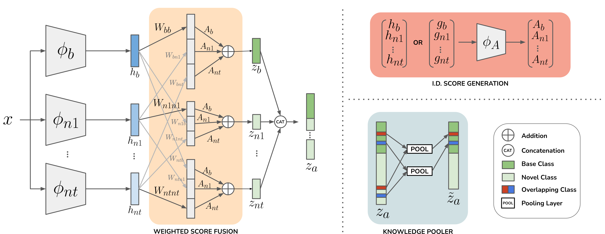

# Multi-Site Class-Incremental Learning with Weighted Experts in Echocardiography

_under review at MICCAI workshop ASMUS-2024_



## Abstract
Training an echocardiography view classifier that generalises and maintains performance in real-life cases requires diverse multi-site data, and frequent updates with newly available data to mitigate model drift. Simply fine-tuning on new datasets results in 'catastrophic forgetting', and can be challenging as the view labels vary between sites. Alternatively, collecting all data on a single server and re-training is not feasible as data sharing agreements may restrict image transfer, or make datasets available at different times. In addition, the time and cost associated with re-training is prohibitive and grows with every new dataset. We propose a class-incremental learning method which learns an expert network for each dataset, which are combined with a score fusion network. We minimize the influence of 'unqualified experts' by weighting each contribution by a learnt in distribution score. Our weighting method promotes transparency as the contribution of each expert is known during inference, and can enable multi-site learning by providing a simple workaround where licensing prevents image sharing but not the sharing of byproduct features. We validate our work on 6 datasets from multiple sites, demonstrating significant reductions in training time while improving view classification performance. 

## Installation
How to set up the environment and install dependencies.

```bash
# Clone the repository
git clone https://github.com/kitbransby/class-incremental-learning-echo.git

# Navigate to the project directory
cd class-incremental-learning-echo

# Create a virtual environment (optional but recommended)
conda create -n class-incremental-learning-echo --file requirements.txt

# activate env
conda activate class-incremental-learning-echo
```


## Dataset
6 datasets were used in this study, of which 5 are proprietary and not publicly available. CAMUS dataset can be obtained [here](https://www.creatis.insa-lyon.fr/Challenge/camus/databases.html). For preprocessing steps, please refer to our paper. We assume all data stored in a separate data directory ``Data`` with the following structure:
```
 Data
   ├── dataset_b
   │   ├── train
   │       ├── 0001_Y.npy
   │       ├── 0002_Y.npy
   │       ├── ...
   │   ├── val 
   │   └── test
   ├── dataset_n1
   ├── ...
   └── dataset_nt
```

Where Y is the classification label. 

## Training
We train several models in our work. Instruction for training each are below.

```bash
# First the base classifier need to be trained. 
# e.g In this project that is with WASE data
python train_vc.py --CONFIG wase_8_class --DATA_ROOT <path-to-data> --RUN_ID <name-of-run>

# For each incremental step, we train a new classifier initialising with base classifier weights. 
# e.g for CAMUS data. update camus_2_class.yaml with RUN_ID of the base classifier, and train
python train_vc.py --CONFIG camus_2_class --DATA_ROOT <path-to-data> --RUN_ID <name-of-run>

# To train the Combine & Retrain baseline 
python train_vc.py --CONFIG combine_all_and_retrain --DATA_ROOT <path-to-data> --RUN_ID <name-of-run>
```

To train the score fusion networks, we first need to compute the feature dataset.

```bash
# First the nmf vector for each classifier are calculated
# Replace RUN_ID weights in models.load_model.load_pretrained_avc with the weights of the classifiers you've trained
python extract_nmf.py --CONFIG extract_nmf --DATA_ROOT <path-to-data> 

# Then we extract nmd, logits and image features which are used as input to SF/wSF models
python extract_augmented_features.py --CONFIG extract_augmented_featuers --DATA_ROOT <path-to-data>

# Repeat for val, test sets (no augmented)
python extract_val_test_features.py --CONFIG extract_val_test_featuers --DATA_ROOT <path-to-data>

# Train our attn-wSF network
python train_score_fusion.py --CONFIG score_fusion_attn --DATA_ROOT <path-to-data> --RUN_ID <name-of-run>

# Train our nmd-wSF network
python train_score_fusion.py --CONFIG score_fusion_nmd --DATA_ROOT <path-to-data> --RUN_ID <name-of-run>

# Train our SF network baseline
python train_score_fusion.py --CONFIG score_fusion --DATA_ROOT <path-to-data> --RUN_ID <name-of-run>
```

To train on your own datasets, you will need to change some code. Here are some starters:
* Each classifier requires a registered dataset in ``utils.load_dataset`` and a config yaml. 
* To train the wSF/SF models, you will also need to edit the list of incremental experts in ``models.load_models.load_pretrained_avc`` and ``utils.dataset_score_fusion.Score_Fusion``
* Likewise with the Combine & Retrain baseline, you need to edit the dataset lists in ``utils.dataset_combine_retrain.Combine_Retrain``

## Evaluation
We evaluate our model on an internal testset (WASE, CAMUS, Medstar, StG) and an external testset (MAHI, UoC). 

```bash
# For SF networks e.g nmd-wSF 
python evaluate_score_fusion_all_data.py --CONFIG score_fusion_nmd --DATA_ROOT <path-to-data> --RUN_ID <name-of-run>

# For single classifiers e.g a model trained with CAMUS data
python evaluate_vc_all_data.py --CONFIG camus_2_class --DATA_ROOT <path-to-data> --RUN_ID <name-of-run>
```

To evaluate on our own datasets, you will need to edit the list of classes and datasets in the ``evaluate....py`` files. 


## Results
Results are saved to ``results/<RUN_ID>`` whenever a training run or evaluation script is launched. 

## Acknowledgements
We thank Tz-Ying Wu et at, the authors of ['Class-incremental learning with strong pre-trained models'](https://arxiv.org/abs/2204.03634), which this paper builds on. 
